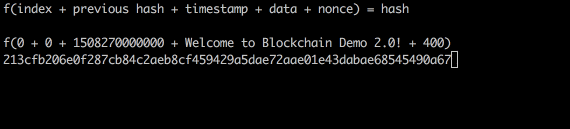

# Blockchain Structure

Blockchains are just fancy databases. Databases have designs based on the data they store. Let's take a look at the architecture behind a blockchain data structure and how it differs from traditional web2 databases...

## Blockchain Architecture

A **blockchain** is a distributed database of a list of validated blocks. Each block contains data in the form of transactions and each block is cryptographically tied to its predecessor, producing a "chain".

Blockchains are not just decentralized but also distributed databases made up of "**nodes**".

In computer science, the term **node** simply means a unit or member of a data structure. For practicality, a node can just be thought of as a computer. So data structures have nodes, or computers, that you use to update data with.

A blockchain has nodes scattered all over the world all acting together in real-time. There is no central administrator, say a "supernode", responsible for verifying any changes to the state of data, all nodes are equal members of the network. This means that the network will perform the same, no matter what node you interact with to update data. In other words, blockchains are **peer-to-peer** networks.

In the image above, the server-based network contains one central server solely responsible for keeping the state of data. In the peer-to-peer network, there is not even a central server - everyone maintains a copy of the state of data.

How do distributed p2p networks agree on what data is valid without a central administrator running the show? 

Consensus mechanisms! The Bitcoin network decides validity of new data based on who is able to produce a valid proof-of-work.

This is a famous computer science problem called the "[Byzantine General's Problem](https://www.mail-archive.com/cryptography@metzdowd.com/msg09997.html)".

## Blockchain Demo

Now that we've covered that a blockchain is a collection of distributed nodes arranged as a peer-to-peer network, let's go through a blockchain demo together! 

Go to this link: https://blockchaindemo.io/. Feel free to go through this excellent demo by yourself, we will also break down a lot of the same info below!

1. Starting on step 3 of the demo, the demo starts by defining a **blockchain**.

    - A blockchain has a list of blocks. It starts with a single block, called the genesis block.

    - New term! The genesis block is simply the first block in a blockchain. The block should have an index of 0 - this is computer science, everything is 0-indexed!

2. Step 4-13 explains the information that each block stores:

    - Index
    - Timestamp
    - Hash
    - Previous Hash
    - Data
    - Nonce

- **index:** The position of the block in the chain.

- **timestamp:** a record of when the block was created. This is typically a UNIX timestamp, aka: the number of seconds since January 1st, 1970. This data is important since it establishes a blockchain as a chronological time-based structure.

- **hash:** this is commonly referred to as the block hash or block header. As opposed to what the demo says, this piece of data is NOT stored in the block but is actually a digital fingerprint representing the block's contents.

    - **How is the block hash calculated?**

        - A hashing function takes **data** as input, and returns a unique hash.

            ```
            f ( data ) = hash
            ```

        - Since the hash is a "digital fingerprint" of the entire block, the **data** is the combination of **index**, **timestamp**, **previous hash**, **block data**, and **nonce**.

            ```
            f ( index + previous hash + timestamp + data + nonce ) = hash
            ```

        - Replace the values for the demo's genesis block, we get:

            ```
            f ( 0 + "0" + 1508270000000 + "Welcome to Blockchain Demo 2.0!" + 604 ) = 000dc75a315c77a1f9c98fb6247d03dd18ac52632d7dc6a9920261d8109b37cf
            ```

- **previous hash:** the hash of the previous block.

- **data:** each block can store data against it.

    - To find a valid hash, we need to find a nonce value that will produce a valid hash when used with the rest of the information from that block.

### What is a "valid" hash?

A valid hash for a blockchain is a hash that meets certain requirements. For the blockchain in the demo, having three zeros at the beginning of the hash is the requirement for a valid hash.

The number of leading zeros required is the **difficulty**.

The process of finding valid hash outputs, via changing the **nonce** value, is called **mining**.

A miner starts a "candidate block" with a nonce of 0 and keep incrementing it by 1 until we find a valid hash:



## Data Integrity in a Blockchain Data Structure

If a blockchain is just a distributed database, how does the data it stores maintain **data integrity**? In other words, how do we make sure the state of the data is never corrupted in any way (ie, data lost, data maliciously manipulated, etc)?

The next parts of the demo touch on how *difficult* it is to manipulate data in a block that already has many blocks mined on top of it.

Since data is an input variable for the hash of each block, changing the data will change that block's hash. The new hash will not have three leading zeros, and therefore becomes invalid. In the same way, blockchains like Bitcoin and Ethereum, protect the integrity of any data held inside blocks in their chains; manipulating data in a block that has been nested deeply in the chain is a fool's errand.

To give an example: In Bitcoin's genesis block, Satoshi sent Hal Finney 10 BTC. Manipulating this value from `10` BTC to `20` BTC (Maybe Hal wants some more BTC!) would require IMMENSE computational power. It's a number so large that humans are not able to grasp how big it is.

### Why is so much computational power required to manipulate data in early blockchain blocks?

Let's look at a simple scenario:

1. he Bitcoin genesis block hash is `000000000019d6689c085ae165831e934ff763ae46a2a6c172b3f1b60a8ce26f`

2. Mallory (crypto term for malicious actor!) manipulates a piece of data, producing a brand new hash for the same block: `eb3e5df5eefceb8950e4a444507ce7df1cc534f54a5113f2792ab64830392db0`

Because of this change, Mallory has causes a data mutation of the genesis block hash! This is where the blockchain data structure is very powerful with data integrity: since the hash of the genesis block changed to be invalid, the block that was previously pointing to it (Block #1) no longer does (because pointers are based on block hashes!). This effect trickles down all the way to the end of the blockchain.

At this point, Mallory has caused a data mutation along the entire chain just by changing one tiny piece of data. In order to continue pushing, Mallory now needs to:

3. Hash the genesis block `data` until a "valid hash" is found

So Mallory, now attacking the chain data integrity, must now hash the manipulated block many times in order to find a hash that meets the Bitcoin network difficulty target at the time.

4. Once a valid hash is found on the manipulated block, **Mallory must repeat the hashing process for EVERY block thereafter in order to successfully "attack" the chain**.

This would take Mallory *trillions* and *trillions* of years of constant computation via hashing. All while the rest of the miner network continues to hash.

5. **Attack unsuccessful!** The blockchain data integrity remains intact.

## Adding a New Block

The demo continues with a brief explanation of what it takes to add new blocks to the blockchain.

When adding a new block to the blockchain, the new block needs to meet these requirements:

1. Block index is one greater than latest block index.

2. Block previous hash equal to latest block hash.

3. Block hash meets difficulty requirement.

4. Block hash is correctly calculated.

## Peer-to-Peer Network / Conclusion

**Who performs validation of new blocks?**

Well, pretty much every participant in the peer-to-peer network performs validation for every single new block proposed-then-added to the chain.

If our blockchain consists of 10 nodes, then we have a peer-to-peer network consisting of 10 nodes all interconnected to each other. When one node, or peer, proposes a new block, every other peer will verify it to make sure it meets the consensus requirements. If it does, the peer adds the block to their own ledger and will see that version as the one "true" chain. So will any other peers rigged up to the same consensus rules.

This is how a peer-to-peer network helps achieve decentralized consensus.


# Further Reading on the Bitcoin Network

## 51% Attack

Most of us have heard the term 51% attack before.

A 51% attack refers to a point in time where a group of miners have control of more than 50% of the network and wish to act maliciously. *How much damage can actually be done during this time?*

Let's think about what we have learned. Every block is built upon the hash of the block before it. To change a block that has been confirmed many times, let's say the block has been confirmed 6 times for example, the attacking blockchain would need to mine **8 new blocks before the existing blockchain mines 1** to be accepted as the Main Chain. This would require *more than just 51% of the resources!*

 Of course, the attacking blockchain could also just stubbornly stick to its chain for a longer period of time. The more time they do this, the more expensive the attack becomes. If they had these kind of resources, they could make significant money just playing along honestly!

 What can the attack actually accomplish? One thing that an attack could do is **double-spend** a transaction, by choosing to override it within the new blocks. So if someone sent you a large payment, they could attack the network and essentially override that payment. Of course, this attack would cost a lot of money, so it's very unlikely this would be cost-effective. For safety purposes, if someone sends you millions of dollars on the blockchain, maybe wait a day or two to be sure it's cleared. 

 We'll talk more about UTXOs which will help us understand how **double-spends** are prevented.

 Double-Spends can occur during a blockchain fork, as shown by the bug caused by the Berkeley DB when the bitcoin network was partially between versions. See [BIP_0050](https://en.bitcoin.it/wiki/BIP_0050).

 ## Genesis Block and the Blockchain Explorer

 It's a good time to check out the [Genesis Block](https://www.blockchain.com/explorer/blocks/btc/000000000019d6689c085ae165831e934ff763ae46a2a6c172b3f1b60a8ce26f) of Bitcoin.

  How many properties do you recognize at this point?

  The number of **confirmations** is the number of blocks since the genesis block. Since the genesis block is the first block, this is also the **block height** of the blockchain!

  It's interesting that if you look at the nonce of the genesis block, it's **2,083,236,893**. If you take a look at a more recent block, [632900](https://www.blockchain.com/btc/block/632900) for example, you'll see that the nonce is actually much lower. Why is that, isn't the difficulty supposed to be getting harder as the network grows?

  It turns out that the block [nonce](https://en.bitcoin.it/wiki/Nonce) is actually a 32-bit field, and `2 ** 32` is **4,294,967,296**, so that is the max size of a nonce. What happens when the miner reaches this point? They can change anything else in the block header to also increase the randomness. Other properties include:

  - **Software Version** - Tracks Bitcoin software upgrades

  - **Previous Block Hash** - Hash of the block before this one

  - **Merkle Root** - We haven't gone over this yet, its a hash that represent all the transactions!

  - **Timestamp** - Approximate time (less than two hours in the future according to consensus rules)

  - **Target** - Difficulty Target that dictates how small the Proof Of Work must be

  As you can imagine by looking at these properties, it was initially the **timestamp** that the miners fiddled with when they need to restart their search for a valid Proof-of-Work. Beyond that, they can start to change the script of the **coinbase transaction** which gives them additional nonce space.
  