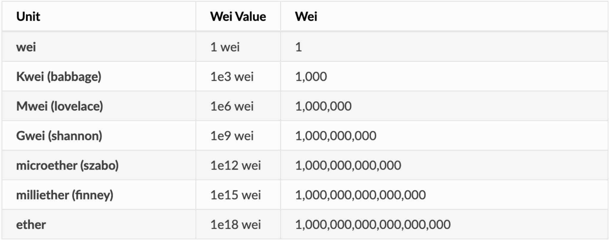
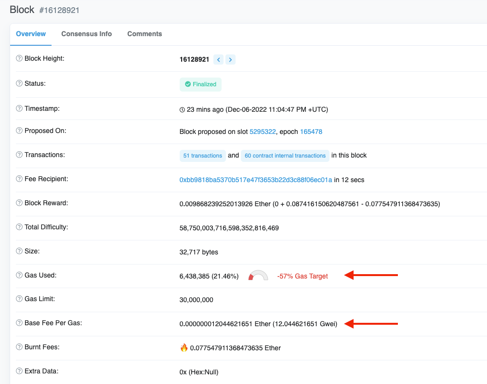
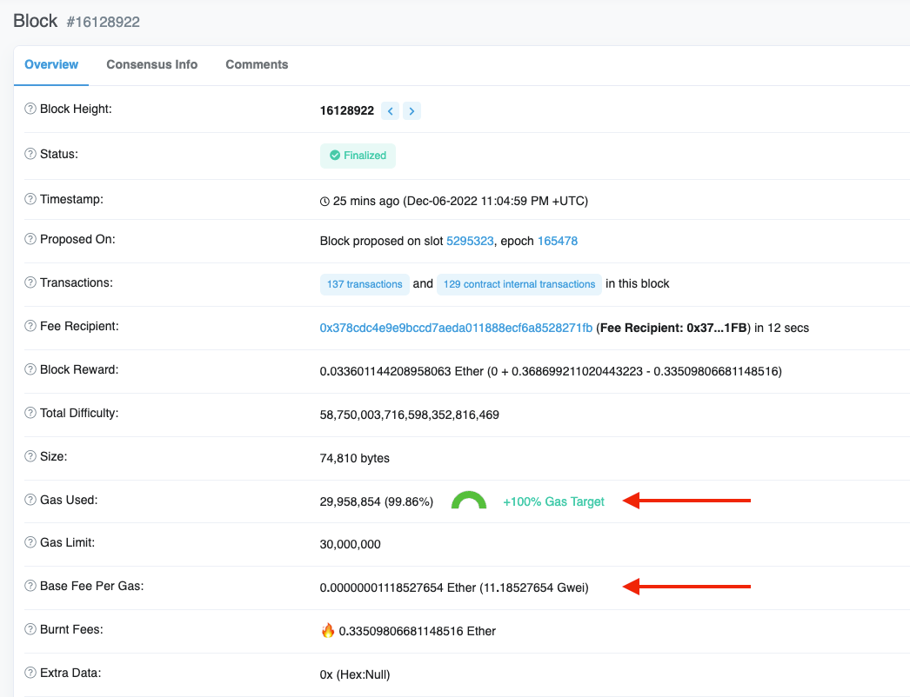

# Gas on Ethereum

In the previous article we talked about the cost of operation codes in terms of gas. In this article we’ll take a look at the actual price of gas and understand what determines it.

## EIP-1559

As many of you may know, the price of gas is something that changes with every block. Historically, gas prices on Etheruem have been unpredictable and at times, astronomically high making transactions inaccessible to most people.

However, In August 2021, after years of research and planning there was an EIP proposed to improve the calculation of gas prices on Ethereum, known as [EIP-1559](https://github.com/ethereum/EIPs/blob/master/EIPS/eip-1559.md). Instead of covering the antiquated computation of gas prices from before EIP-1559, we’re just going to focus on how this works for the current state of Ethereum (post EIP-1559). If you want to learn more about the specific dynamics of EIP-1559 from a developer perspective, check out this [resource hub](https://docs.alchemy.com/docs/eip-1559).

| Denomination    | Value In Ether | Common Usage              |
| ---             | ---            | ---                       |
| Wei             | 10^-18         | Technical implementations |
| Gwei (giga-wei) | 10^-9          | Human-readable gas fees   |
|                 |                |                           |

## Gas Prices

The cost of operations on Ethereum are fixed and measured in amount of “gas”, however the price of that gas (measured in Gwei) is ever-changing. We are going to understand how these prices are set so that you can be more informed about transaction costs.

 To view the latest gas prices you can check out [Etherscan’s Ethereum Gas Tracker](https://etherscan.io/gastracker) that gets updated in realtime.

 With EIP-1559 the mechanism for setting the gas price has shifted from the previous model. We’ll be discussing the current way gas prices are determined since the legacy mechanism has been deprecated.

 ## Denominations of Ether

 Just like dollars, Ether has different denominations that are used to express smaller values, particularly when describing gas costs. For example, similar to how 1 dollar is equal to 100 pennies, 1 ether is equal to 10^18 Wei (the smallest denomination of Ether) or 10^9 Gwei. Here is a table with the relevant denominations for ether and their common use cases:

You’ll often see gas cost estimates listed in Gwei, however if gas were to become much more or much less expensive we may see that denomination change to a different value.

 Gwei vs. Gas Gwei is not the same value as “gas” that we discussed as fixed cost for operation codes in the Intro to Ethereum section.

 ## How is the price of gas set?

 Every block has a maximum amount of gas that can be used within it. This is how the number of transactions included within a block are determined. Every block has the capacity to use 30 million gas but has a target of 15 million gas total.

 The price of gas is determined by the amount of demand for transactions (or block space), where demand is measured by how filled the previous block was relative to the target gas. So let’s look at an example here:

 

 The above screenshot shows two different blocks, one where block space was in high demand, and another where it was in lower demand. The network first sets a `base fee`, in an ideal world this base fee would result in 15 million gas getting used in a block, no more, no less. However, what happens in practice is the actual gas can be above or below the target gas.

When blocks are above the target, the gas price (or `base fee`) is automatically increased, increasing the cost and barrier to entry for sending transactions and thereby reducing the number of people who are competing to fill the block. When the block is below the target the `base fee` is lowered to incentivize people to transact by lowering the barrier to entry for paying for a transaction.

This base fee helps users select an efficient gas amount that is likely to get their transaction mined rather than wasting tons of money on unnecessarily high gas prices like we’ve seen in the past. These mechanisms also make it easy to predict future gas prices by looking at how “full” the previous blocks were.

We can actually see what this looks like in practice by visiting [etherscan](https://etherscan.io/). Let’s take a look at block [16128921](https://etherscan.io/block/16128921) for example:

we can see here that we are 57% below the desired gas target (only using 6.4 million gas instead of 15 million) and our base fee per gas is 12.044621651 Gwei. What do we think will happen with the next block? Will the base fee increase or decrease?

Here is a screenshot of block [16128922](https://etherscan.io/block/16128922)

We can see that the base fee decreased to 11.18 Gwei and by doing so this incentivized more people to send transactions and the gas used skyrocketed up to almost 30 million, 100% above the gas target! Now what do we think will happen with block [16128923](https://etherscan.io/block/16128923)? See for yourself!

## What happens to the base fee?

Instead of going straight into the miners pocket, the `base fee` actually gets burned. There are several reasons why the base fee is burned instead of being given to the miner:

1. This prevents the miner from circumventing the payment of the base fee since they have to pay at least `base fee` * # of transactions for the block that the mine

2. Burning the Ether also creates a deflationary pressure on Ether as an asset since supply is being taken out of the market.

## Setting the gas for your transaction

Turns out when you are sending a transaction, you’re not actually setting the `base fee` value, but rather your setting the `max fee` which represents the maximum amount that you're willing to pay to get your transaction included. Luckily, unlike with the previous gas usage model, your transaction will only ever use the `base fee`** amount to execute, the rest of the value (`max fee` - `base fee`) will be return to you.

As a dApp develop you can actually create your own algorithm to determine how much gas to include in your transactions using endpoints like [`eth_feeHistory`](https://docs.alchemy.com/reference/eth-feehistory). If you’re interested in learning how to build this, check out [How to Build a Gas Fee Estimator using EIP-1559](https://docs.alchemy.com/docs/how-to-build-a-gas-fee-estimator-using-eip-1559).

## How are miners paid?

Since the `base fee` is entirely burned, the new incentive for miners is now known as the miner `tip`. In a perfect world, the miner tip is the minimum amount that the miner is willing to accept in order to execute your transaction. This tip was originally set as 1gwei but can fluctuate depending on how full blocks are. Since the target gas value in blocks is 15M, in general, so long as blocks are hitting or near the target amount, there will always be room to add more transactions within a block. This is why the miner tip does not need to be insanely high to get your transaction included.

Typically when you set the gas for your transaction you’re setting a value called `maxPriorityFee` which is equal to the `max fee` + the miner `tip`. 