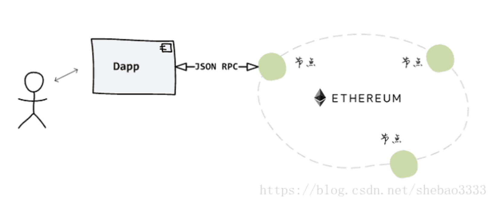
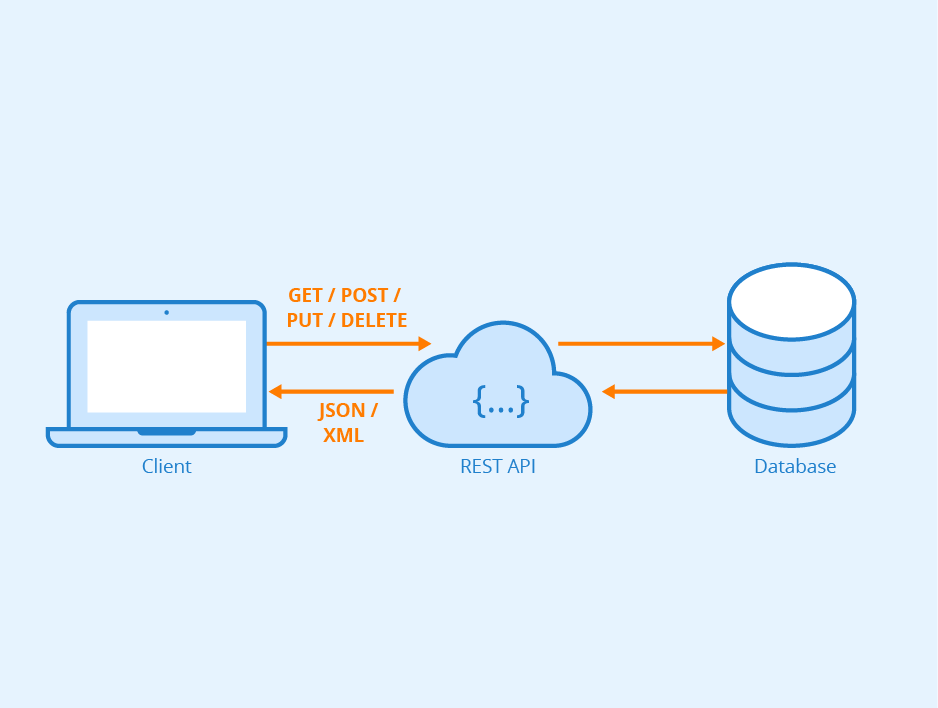
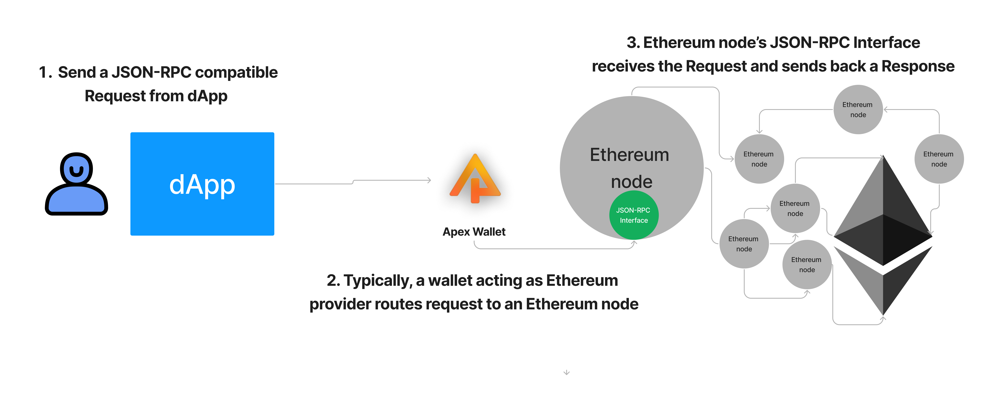
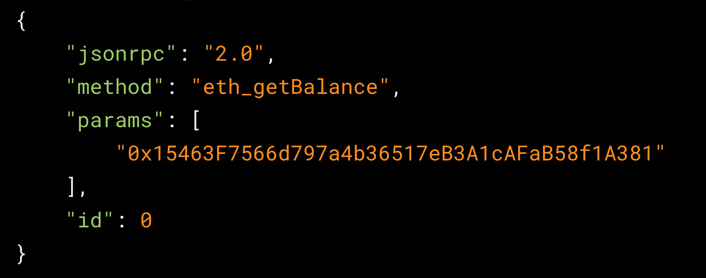
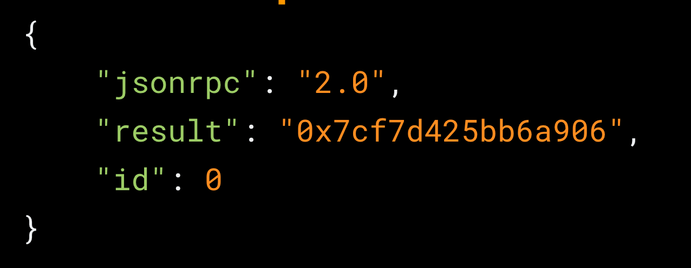

# Intro to JSON-RPC

## Intro

Ethereum is simply a computer for all intents and purposes. The main difference is that this single computer is spread out over thousands of nodes worldwide. The Ethereum computer is built in such a way that it does not matter which of these nodes you communicate with, you are ultimately only affecting one single instance: the Ethereum world state trie singleton.

Conceptually, that's all fine and well. But how do we actually communicate with the Ethereum computer? The answer is: **JSON-RPC**.

## What We Are Ultimately Trying To Build

The above image is a super simplified view of what we will learn today: JSON-RPC is the bridge we use to connect any dApp we use/build to an Ethereum node, and thus the greater Ethereum network.

Keep this diagram in mind as we further learn about communicating data via JSON-RPC! 

## Core Concept: Ethereum Clients

[To run an Ethereum node, you must run one of the various Ethereum client implementations](https://ethernodes.org/). You will see, there are quite a few including:

- [geth](https://github.com/ethereum/go-ethereum): Ethereum client written in Go

- [erigon](https://github.com/ledgerwatch/erigon): Ethereum client also written in Go

- [nethermind](https://github.com/NethermindEth/nethermind): Ethereum client written in .NET

[Here is some more information on Ethereum nodes and clients](https://ethereum.org/en/developers/docs/nodes-and-clients/).

The main takeaway at this point is: in order to run a node, you must download, install and run an Ethereum client implementation. These Ethereum clients use JSON-RPC, and thus define methods like `eth_getBlockByNumber` that are by-default queryable by any JSON-RPC compatible Request. More below...

## Core Concept: JSON-RPC

[JSON-RPC](https://www.jsonrpc.org/) is a remote procedure call (RPC) protocol that uses JSON to encode messages. In other words, JSON-RPC is simply another API standard.

JSON-RPC is a similar API standard to [REST](https://www.redhat.com/en/topics/api/what-is-a-rest-api), typically considered useful for [CRUD](https://en.wikipedia.org/wiki/Create,_read,_update_and_delete).

JSON-RPC deals exclusively with transporting data in the syntax form of [JSON](https://www.w3schools.com/js/js_json_intro.asp). RPC (remote procedure call) on the right hand side of the term simply gives us more clues that this is a communication protocol. Whenever you see "RPC", think: "there is a server out there and I want to call a method on it by executing a remote procedure call".

All Ethereum nodes contain a [JSON-RPC interface](https://ethereum.org/en/developers/docs/apis/json-rpc/). This means that some of the following methods are directly queryable to an Ethereum node:

- [`eth_blockNumber`](https://docs.alchemy.com/reference/eth-blocknumber)

- [`eth_getBalance`](https://docs.alchemy.com/reference/eth-getbalance)

- [`eth_getBlockByNumber`](https://docs.alchemy.com/reference/eth-getblockbynumber)

- [`eth_sendRawTransaction`](https://docs.alchemy.com/reference/eth-sendrawtransaction) (covered in the next module)

Here's a [fuller documentation of all the methods](https://docs.alchemy.com/reference/ethereum-api-endpoints) that are contained in the Ethereum JSON-RPC interface, ready to be pinged at any moment by the dApps we will build!

## Visualization of API Standards: REST and JSON-RPC

REST is a very popular API standard. If you've ever worked with databases and record-keeping, chances are you've used the REST API standard. This is what that flow looks like:

**REST flow:**

1. You have some client application (ie. Twitter)

2. The client application sends a request, for example: `DELETE_TWEET`

3. The database, loaded with a REST API standard interface, accepts the request, updates the resource (deletes a tweet) and sends back a response, either success or fail

JSON-RPC is a very similar flow, in the sense that you are sending Requests and getting back Responses to a server - in our case, an Ethereum node acting as a listening server!

**JSON-RPC flow:**

1. On the client side, formulate a JSON-RPC request. Typically, this would be you or a user clicking a button that initiates some action to the Ethereum computer, for example, a button that is rigged to make a `eth_blockNumber` request to the provider

2. Your web3 wallet, acting as a provider, will route the `Request` to the Ethereum node it is connected to

3. The Ethereum node will receive the `Request`, run the `eth_blockNumber` method in the request and send back a `Response` containing the latest block # on Ethereum

Remember, `provider` is just a fancy term for something representing a connection to an Ethereum node!

## JSON-RPC Request

The above is what a JSON-RPC [`Request`]() that asks for the account balance of an address looks like. It specifies:

1. The `jsonrpc` version, which is **always** `2.0`

2. The specific `method` that you would like to call (must be a method in the interface!)

3. Any `params` relevant to the `method` called

4. The `id` of the request is any arbitrary number you choose. The `id` property is only relevant when you are batching requests, if you are making stand-alone requests you can just use `0`.

## JSON-RPC Response

The above is what a JSON-RPC [`Response`](https://www.jsonrpc.org/specification#response_object) looks like, in particular the response to the `eth_getBalance` request made above.

The `Response` contains:

1. The `jsonrpc` version just mirrored back, always `2.0` 

2. The `result` of the `eth_getBalance` query, in this case `0x7cf7d425bb6a906`, which is the hexadecimal representation of `562806202404612350 wei` which is simply `0.56280620240461235 ETH` worth of an account balance 💯

    - We used this converter: https://www.alchemy.com/gwei-calculator to convert from `wei` to `ether`

3. The `id` of the single request

## JSON-RPC Tools

Try using the [Alchemy Composer](https://dashboard.alchemy.com/composer) to make JSON-RPC requests in an instant! Try a few different methods!

## Suggested Reading

- [Why is Ethereum using hexadecimal for numbers?](https://ethereum.stackexchange.com/questions/26710/why-is-ethereum-json-rpc-using-hexidecimal-for-numbers)

## Conclusion

Thanks to every [Ethereum node containing a JSON-RPC interface](https://ethereum.github.io/execution-apis/api-documentation/), we can communicate with the Ethereum blockchain in an instant. We can make important READ requests like `eth_getBlockByNumber` and `eth_getBalance` to the Ethereum blockchain at any time.

In this section, we learned how to manage basic **read** requests from Ethereum. What if we want to **write** to the Ethereum computer? As in, actually make a change of state! Anyone can ask for information any time (did you try the Alchemy Composer?), but what about requests to write information to Ethereum? These write requests can be contract interactions or even a simple Ethereum transfer. The next section covers signed JSON-RPC requests, in other words: _**transactions**_.

