# Intro to Ethereum Transactions

## Intro

We learned that Ethereum nodes contain a JSON-RPC interface which we can use to send JSON-RPC requests. We looked mainly at how to do read-only requests... basically just requests that ask the Ethereum computer for data. We are only reading from the ledger at this point. What about writing?

The vehicle to "write", or change the state of the Ethereum computer, is the **transaction**. Let's dive in...

## Ethereum = A Transaction-Based State Machine

First of all, let's get it straight: **the Ethereum computer** lives and breathes transactions. They are the only vehicles that can actually change any state in the computer, as show in the diagram below.

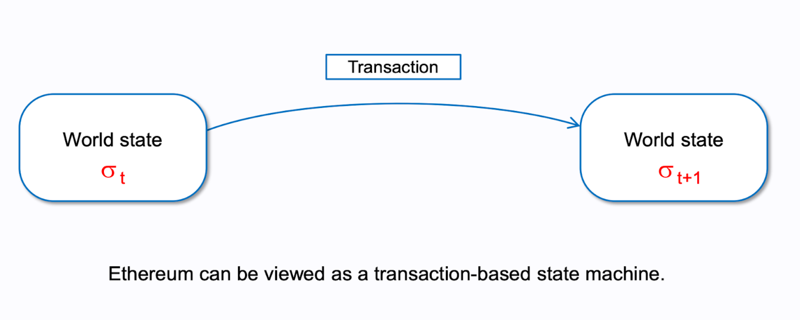

## What is a Transaction? (Ethereum)

An Ethereum transaction refers to an action initiated by an EOA (externally-owned account), in other words an account managed by a human, not a contract.

For example, if Bob sends Alice 1 `ETH`, Bob's account must be debited and Alice's must be credited. **This state-changing action takes place within a transaction**.

## Block & Transactions


Notice how the World state begins at `σt` and when a block full of transactions is applied to it, the world state then becomes `σt+1` - this is just a way to quickly diagram the Ethereum world state changing in this diagram and further below.

**Transactions** are collected into blocks. A **block** is a package of data (in the form of transactions.)

## Chain of States


If you focus on how the global singleton world state of Ethereum changes after each block, Ethereum can be seen as a chain of states.

## Chain of Blocks... A Blockchain!


Blocks, packed with transactions, are the ultimate state-changers to the Ethereum world state. Focusing purely on the blocks, Ethereum can then also be seen as a chain of blocks... or a... BLOCKCHAIN!

## Stack of Transactions

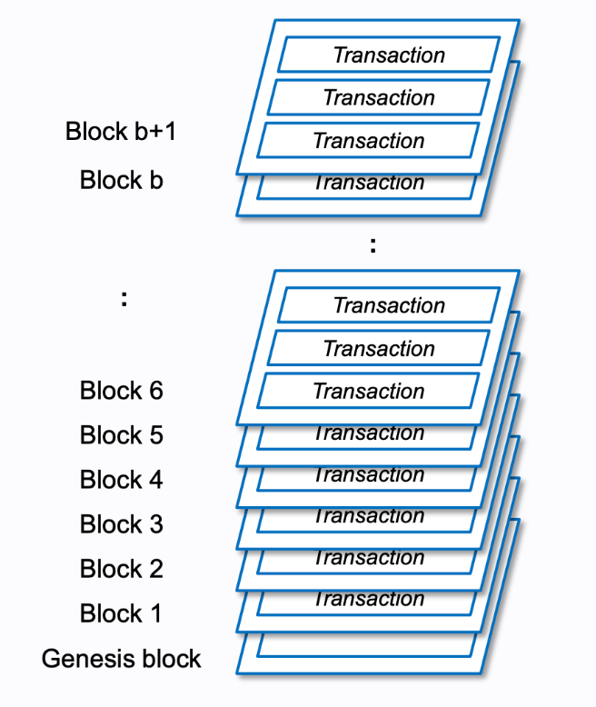

If you ignore the block-based view and focus purely on a ledger view (just focusing on the numbers), Ethereum can then be seen as just a collected stack of transactions. Each transaction subsequently changes the state, and so these state-changers are simply stacked!

## Refresher on the Ethereum World State

Ethereum can be viewed as a chain of states. There is only ever one single world state and that world state is changed by blocks packed full of data in the form of transactions.


As seen above, the **Ethereum world state** is simply a mapping between Ethereum addresses and their account state.

Several Views of Ethereum World State

The Ethereum world state can be seen from several perspectives, all just different conceptual vehicles - choose the one that best fits your conceptual understanding!

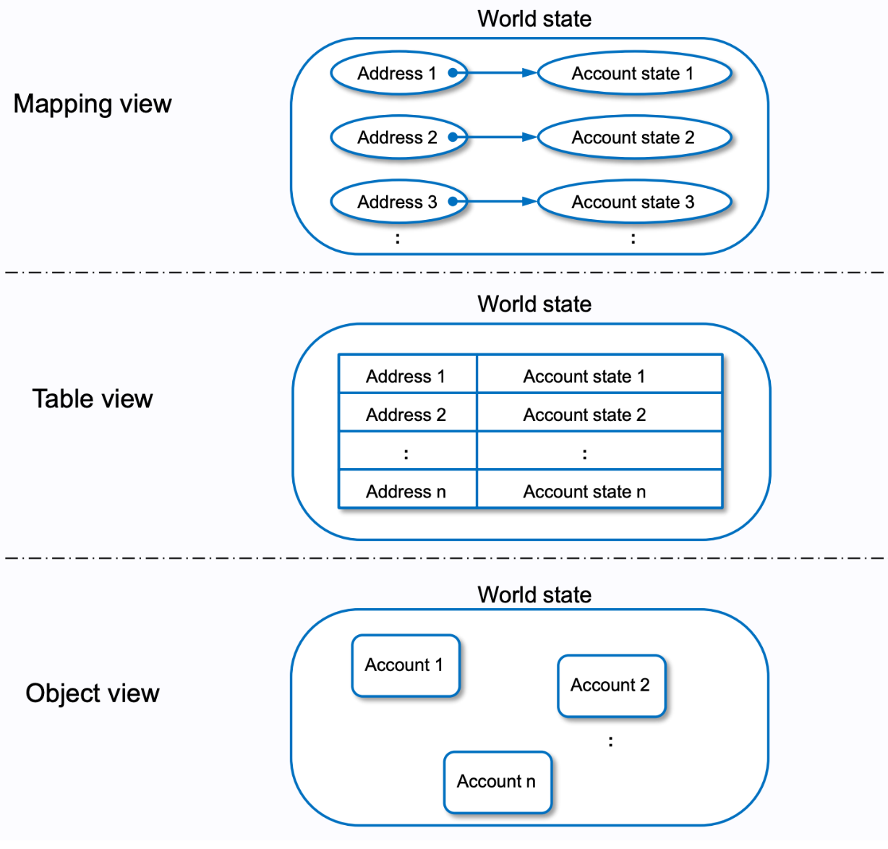

As seen above, the Ethereum world state can be seen as a mapping, table or an object. It is the ultimate source of all Ethereum state including balances and smart contract code + state.

Accounts are simply ledger entries that are indexed via a public address into the world state. Query the world state by providing it an Ethereum address, and the world state will return that address's account state (balance, nonce, smart contract code & state if applicable).

Try it on the [Alchemy Composer](https://composer.alchemy.com/) now! Try the `eth_getBalance` method and get Vitalik's (`0xd8dA6BF26964aF9D7eEd9e03E53415D37aA96045`) ETH balance! This query is sent directly to the Ethereum world state!

## Wait, So An Account Can Be A Smart Contract?

Yes. **There are two types of accounts in Ethereum**:

1. **EOA**: This is an account directly controlled by a private key 

    - An EOA cannot contain EVM code

2. **Contract account**: This is an account that does NOT have a private key 

    - As seen in the diagram, this account contains two extra properties on its state: 

        - **storage hash**: contains the root hash of a Merkle patricia trie that holds any state relevant to this smart contract account (ie. variable values, owners, etc)

        - **code hash**: bytecode representation of skeleton code


## How Are The Account Public Addresses Determined?

If the account is an EOA, the Ethereum public address is derived from the private key. If the account is a smart contract, that smart contract public address is derived from the deployer address and the deployer nonce value. Better seen here:

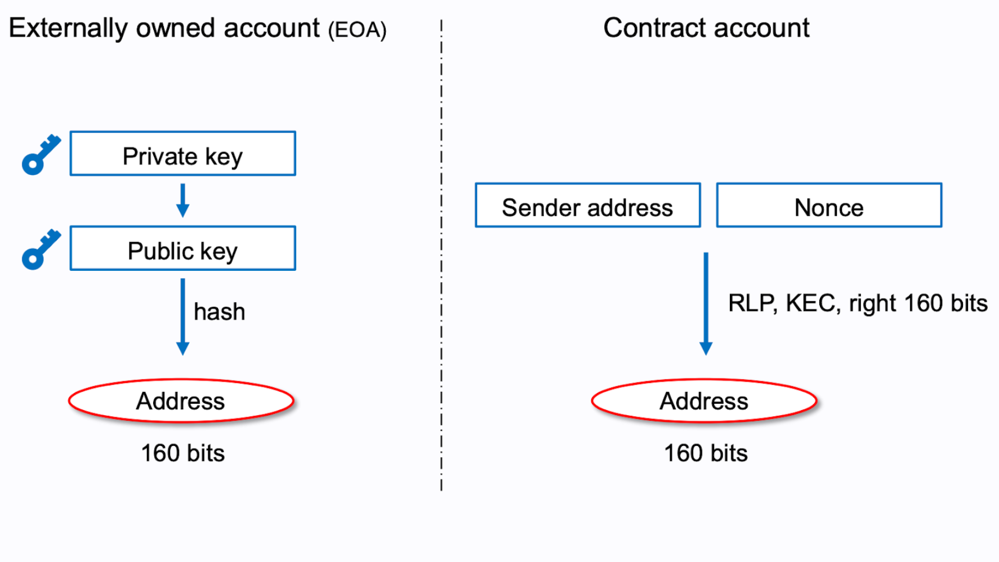

The output, regardless of whether the account is an EOA or a smart contract, is always 160 bits representing the Ethereum public address. You'll typically hear Ethereum public addresses described as 20 bytes long with a `0x` appended in front. You may also hear Ethereum addresses are 40-characters long, or 42 with the `0x` appended in front.

- 1 byte = 2 hexadecimal characters = 8 bits!

## Ok, Back to Transactions

Why did we tangent into exploring the Ethereum world state and types of accounts on Ethereum? Well, because transactions directly affect the world state and it's important to know what types of accounts are behind those transactions!

Let's jump back into focusing specifically on **transactions**...


A **transaction** is a single cryptographically-signed instruction. It is a signal of intent from an owner of a private key that they want to change the Ethereum state in one way or another.

Reading data from Ethereum does not require an account! Anyone can ping the Ethereum computer and read data instantly... did we mention [Alchemy Composer](https://composer.alchemy.com/) is a thing? 👀 But writing data requires you own a private key and some ETH (to pay for gas!)... all write operations cost gas and so you need ETH to pay for that gas. And all write operations must be signed by a private key!

Trivia: Can smart contract accounts initiate a transaction?


Notice in the diagram above, only an EOA can send a transaction to Ethereum. EOAs are typically human-controlled accounts; humans are in the real physical world. The bridge to the Ethereum metaverse is transcended via submitting transactions. As an external entity to the Ethereum computer, an EOA signals an intent to change state in the metaverse with a valid transaction.

## Two Types of Transactions in Ethereum

In Ethereum, there are two practical types of transactions:


1. **Contract creation**: a special type of transaction that deploys a brand new smart contract This transaction essentially creates a brand new entry in the Ethereum world state

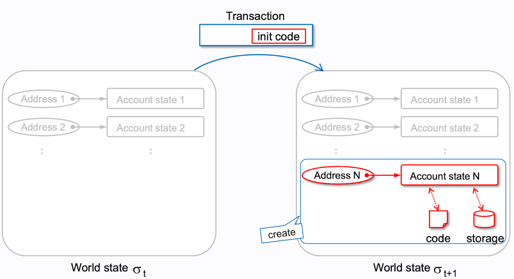

2. **Message call**: a transaction initiated by an EOA that interacts with either another EOA or a smart contract

    This transaction does NOT create a new entry in the world state, it just updates an existing entry in the Ethereum world state.

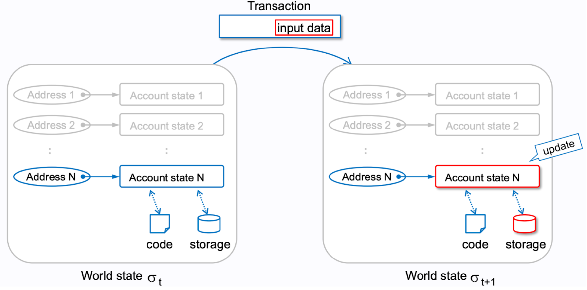


## Ethereum Transaction Architecture


The above diagram shows all the properties that are packaged up within an Ethereum transaction.

- The diagram shows what some refer to as a Type 2. Type 2 transactions are any transactions that are not Type 1, or legacy. Legacy transactions are transactions that do not include the EIP-1559 upgrades. You can distinguish what type a transaction by looking at the `type` property of the transactions on explorers like [Etherscan](https://etherscan.io/).

Let's define all of the transaction fields present above:

- `nonce`: index, gets incremented every time transaction gets mined

- `recipient`: the receiving address (if an externally-owned account, the transaction will transfer value. If a contract account, the transaction will execute the contract code)

- `value`: amount of ETH to transfer from sender to recipient (in WEI, a denomination of ETH)

- `yParity, r, s`:

- `init or data`: (aka: digital signature): signature components

- `gasLimit`: typically referred to as “calldata”, `0` if just a typical ETH transfer

- `type`: maximum amount of gas units that can be consumed

- `maxPriorityFeePerGas`: (aka: minerTip): the maximum amount of gas to be included as a tip to the validator

- `maxFeePerGas`: the maximum amount of gas willing to be paid for the transaction (inclusive of `baseFeePerGas` and `maxPriorityFeePerGas`)

- `chainId`: in order to protect against replay attacks on other EVM chains, each transaction must now include a specific id per chain. Mainnet is `0`. Göerli is `5`. You can check other chain ids here: https://chainlist.org/

The main difference between a read-only JSON-RPC query and a write JSON-RPC request is the fact that only the write request requires a digital signature. So, you must send a signed JSON-RPC Request, in other words, a **transaction**.

- If you want to read data from Ethereum, a standard JSON-RPC request will do (ie.`eth_getBalance`). If you want to write data to Ethereum, a signed JSON-RPC request is needed, otherwise referred to as, a transaction. [Here is further review on the Ethereum transaction object](https://docs.alchemy.com/docs/understanding-the-transaction-object-on-ethereum).

## Blockchain = Globally Shared Transaction Database

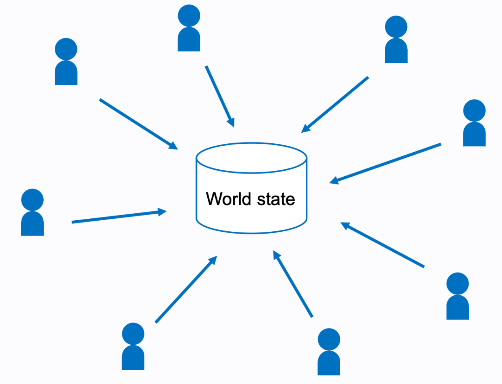

Transactions are so important, that one can refer to a blockchain as a globally shared, transactional database. They are the heart and soul of what drives the state changes behind Ethereum.

## P2P Network

Not only are blockchains globally-shared databases, they are globally-shared **decentralized** databases:

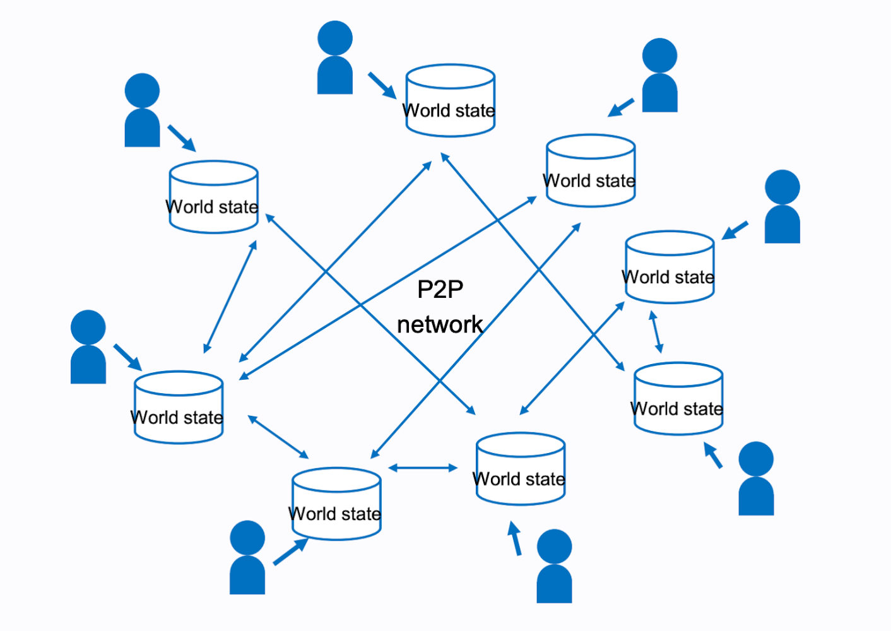

Everyone keeps a copy of the latest Ethereum world state. When a new block packed full of state-changing transactions gets mined, the block is independently verified by every node in the peer-to-peer network. If the block is truthful (no double spending transactions, all digital signatures check out, etc) then the node adds that block to their own local version of the blockchain as the latest representation of the Ethereum world state. This happens every time a block is mined: worldStaten transitions to worldState `n+1` and so on.

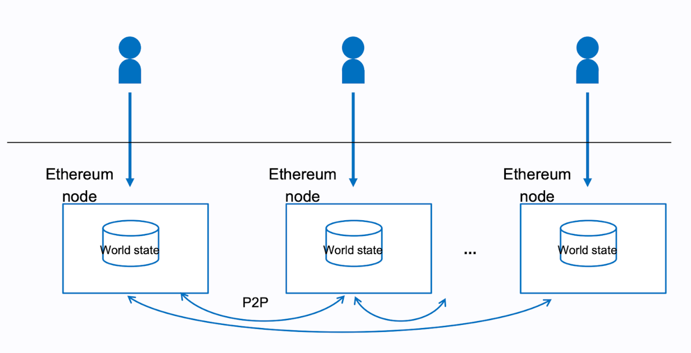

The Ethereum network is made up of nodes decentralized all over the world. Each of these nodes performs verification on any new block of transactions being added to the Ethereum blockchain.

We've learned that in order to interact with one of these nodes constituting the Ethereum P2P network, one must send a JSON-RPC request (in order to read data, which anyone can do!) or send a _signed_ JSON-RPC request (in order to write data, which means you are changing some state in the Ethereum computer).

- Remember, a "_signed_ JSON-RPC request" is just fancy a fancy term for transaction.

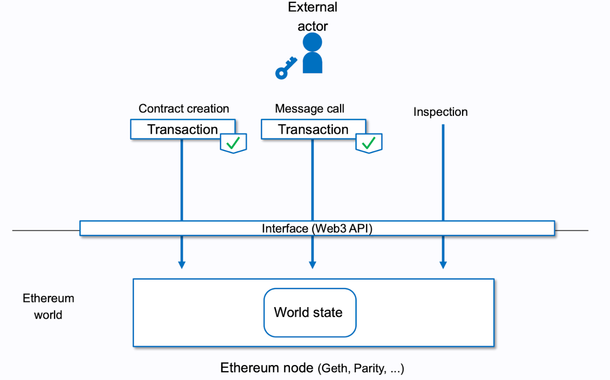

As the diagram above shows, as an EOA, you have three routes to interact with the Ethereum computer via a connection to an Ethereum node:

1. **Contract creation**: As an EOA, you deploy a new smart contract to the Ethereum computer via a special transaction (signed JSON-RPC request)

2. **Message call**: As an EOA, you either send some ETH to another EOA or interact with a smart contract in some way via a transaction (signed JSON-RPC request)

3. **Inspection**: Any user can make read queries to any Ethereum nodes, no account needed. Try out the `eth_getBalance` method in the [Alchemy Composer](https://composer.alchemy.com/) if you don't believe us! (non-signed JSON-RPC request)

## Transaction Object Example

1. Alice sends Bob `1 ETH`

```JSON
{
  to: "0x2c8645BFE28BEEb6E19843eE9573b7539DD5B530", // Bob
  gasLimit: "21000",
  maxFeePerGas: "30", // 28 (base) + 2 (priorityFee)
  maxPriorityFeePerGas: "2", // minerTip
  nonce: "0",
  value: "100000000000000000", // 1 ether worth of wei
  data: '0x', // no data, we are not interacting with a contract
  type: 2, // this is not a legacy tx
  chainId: 4, // this is AU, we deal only in test networks! (Göerli)    
}
```

2. Alice calls a function on a smart contract

```JSON
{
  to: "0xEA674fdDe714fd979de3EdF0F56AA9716B898ec8", // smart contract address
  gasLimit: "36000",
  maxFeePerGas: "30", // 28 (base) + 2 (priorityFee)
  maxPriorityFeePerGas: "2", // minerTip
  nonce: "1", // this is Alice's second transaction, so the nonce has increased!
  value: "100000000000000000", // 1 ether worth of wei
  data: '0x7362377b0000000000000000000000000000000000000000000000000000000000000000', // this calldata tells the EVM what function to execute on the contract, contains parameter values here as well
  type: 2, // this is not a legacy tx
  chainId: 4, // this is AU, we deal only in test networks! (Göerli)    
}
```

Wait a second, how the heck did the `data` for the contract interaction get calculated? Let's cover this...

## How To Manually Construct Calldata

Once we send a transaction that points to a smart contract, how does the contract know what specific function you intend to call? Well, all those specifics end up going in the `data` field of each transaction.

Here is the algorithm to manually construct calldata:

1. Say Alice wants to call the `withdrawEther()` function of a faucet smart contract...

2. Alice must take the [keccak256](https://emn178.github.io/online-tools/keccak_256.html) hash of that function signature:


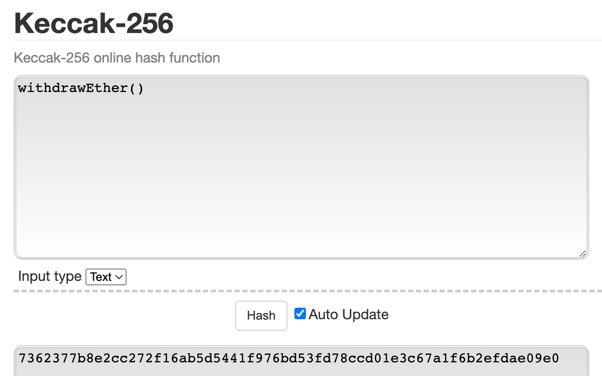

The resulting output is: `7362377b8e2cc272f16ab5d5441f976bd53fd78ccd01e3c67a1f6b2efdae09e0` 

3. Take the first 4 bytes (8 characters) of the hash output, which is just: `7362377b`

4. This function takes no arguments, so no need to append any parameter data

    - If the function took arguments, you would need to hash the entire function signature with that parameter type, for example: `helloWorld(uint256)`

5. Final calldata construction, padded out to 32 bytes: `0x7362377b0000000000000000000000000000000000000000000000000000000000000000`

## Conclusion

Phew... what a learning blast! The TLDR is: transactions rule everything in Ethereum. They are they main changers of state, so we should know them down to the architecture level... which after today, we do!

We are still at the low-level at this point. We saw how to make read requests in the previous activity quite easily. We won't make you perform a signed request as an activity... why? Because it's quite a long script to write! Trust us, we've gotten low-level enough. We have just one more module left this week: Intro to Ethers.js. Tools like Ethers.js and the Alchemy SDK abstract all the low-level dealings we see here away from us, allowing us to focus on pure development. You'll see. We learned the low-level so that we become competent web3 developers, but we'll learn all the high-level libraries meant to make us web3 developer superstars... starting with [Ethers.js](https://docs.ethers.io/v5/) and the [Alchemy SDK](https://www.alchemy.com/sdk).
