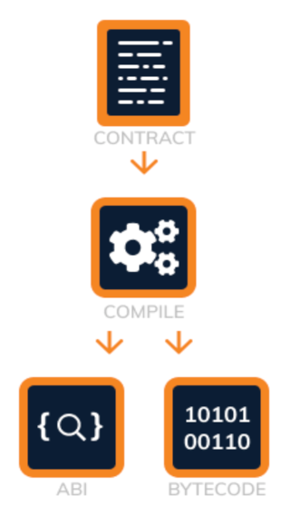
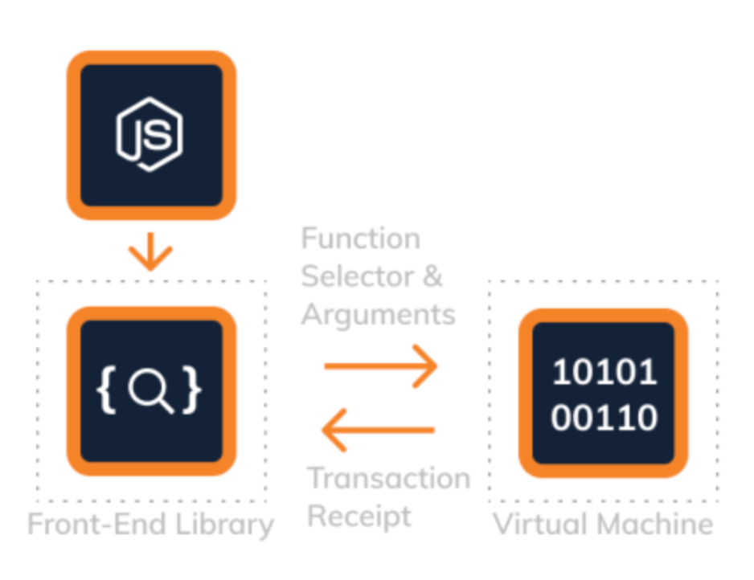
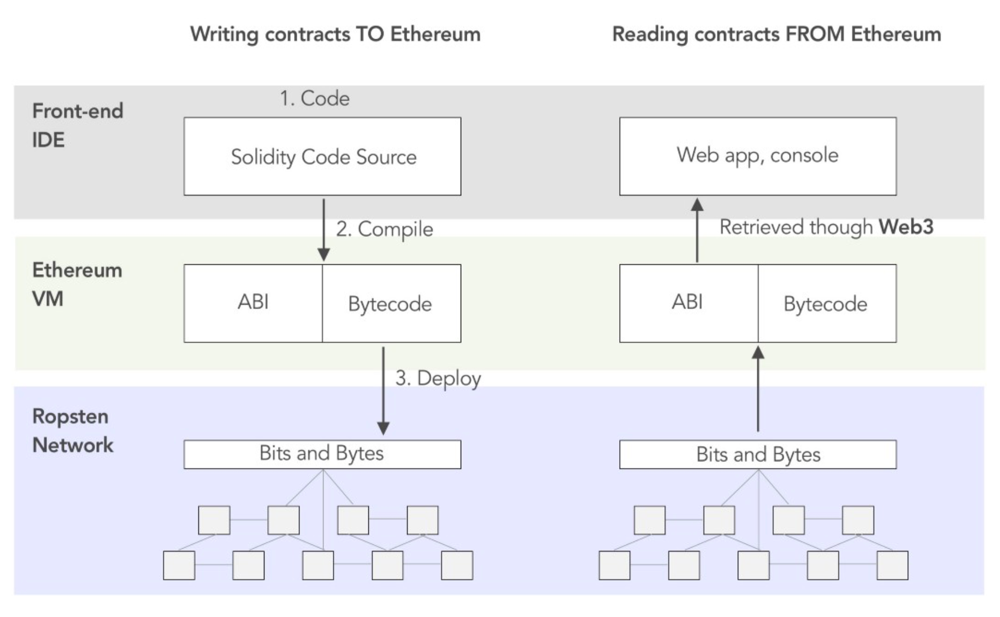

# Smart Contract Communication

## Smart Contract Compilation

Up until now, we've learned about the Solidity programming language and how it used to write programs on the Ethereum computer, otherwise referred to as **smart contracts**.

Let's get a little lower-level... In order to understand how contracts communicate, we must first understand:

1. contract **compilation**

2. contract **deployment**

3. contract **interaction**

## Contract Compilation Produces Two Artifacts: ABI & Bytecode

When a smart contract is compiled, the Solidity compilation process produces two _very important artifacts_:



1. [the contract's ABI](https://docs.soliditylang.org/en/v0.8.13/abi-spec.html): 
    - we _keep_ the ABI for front-end libraries to be able to communicate with the contract

2. the contract's **bytecode**
    - we _deploy_ the bytecode directly to the blockchain, in which case it is stored directly in the contract account's state trie

## ABI - Application Binary Interface (Computer Science)

In computer science, an ABI is typically an interface between two program modules. For example, an operating system must communicate with a user program somehow. That communication is bridged by an **ABI**, an **Application Binary Interface**.

An ABI defines how data structures and functions are accessed in the machine code. Thus, this is the primary way of encoding/decoding data in and out of machine code.

You can think of an ABI as a general encoding/decoding bridge for machine code.

## ABI - Application Binary Interface (Ethereum)

**In Ethereum, a contract's ABI is the standard way to interact with a contract.**

The ABI is needed to communicate with smart contracts, whether you are:

- attempting to interact with a contract from outside the blockchain (ie. interacting with a smart contract via a dApp)

- attempting a contract-to-contract interaction (ie. a contract performing a `JUMP` call to another contract), `t`

The ABI is used to encode contract calls for the EVM and to read data out of transactions.

In Ethereum, the purpose of the ABI is to:

1. **define the functions in the contract that can be invoked** and...
2. **describe how each function will accept arguments and return its result**

## What Does the ABI Look Like?

Let's look at a quick Solidity smart contract:

```Solidity
// SPDX-Licence-Identifier: MIT
pragma solidity 0.8.4;

contract Counter {
    uint public count;

    // Function to get the current count
    function get() public view returns (uint) {
        return count;
    }

    // Function to increment count by 1
    function inc() public {
        count += 1;
    }

    // Function to decrement count by 1
    function dec() public {
        // This function will fail if count = 0
        count -= 1;
    }
}
```

`Counter.sol` is a simple smart contract that presides over one single state variable: `count`. There are a few function that directly control the `count` state and anyone can call them. That's all fine as well, but what if we want to cool a function from this contract from a front-end library like Ethers.js? This is where you'll need the ABI!

This is what the `Counter.sol` ABI looks like:

```json
[
	{
		"inputs": [],
		"name": "count",
		"outputs": [
			{
				"internalType": "uint256",
				"name": "",
				"type": "uint256"
			}
		],
		"stateMutability": "view",
		"type": "function"
	},
	{
		"inputs": [],
		"name": "dec",
		"outputs": [],
		"stateMutability": "nonpayable",
		"type": "function"
	},
	{
		"inputs": [],
		"name": "get",
		"outputs": [
			{
				"internalType": "uint256",
				"name": "",
				"type": "uint256"
			}
		],
		"stateMutability": "view",
		"type": "function"
	},
	{
		"inputs": [],
		"name": "inc",
		"outputs": [],
		"stateMutability": "nonpayable",
		"type": "function"
	}
]
```

As you can see, the ABI of a contract is just one big JSON object. As developers, we simply need to know that the ABI is necessary in order for front-end tools to be able to interface and thus communicate with a smart contract! This is further explained in the **ABI Encoding** section below.

- If you aren't familiar with the term "calldata", make sure to review the last section of Intro to Transactions.

## ABI vs API

Similar to an API, the ABI is a human-readable representation of a code's interface. An ABI defines the methods and structures used to interact with the machine code representation of a contract, just like APIs do for higher-level composability.

## ABI Encoding

The ABI indicates to the caller of a contract function how to encode the needed information, such as function signatures and variable declarations, in such a way that the EVM knows how to communicate that call to the deployed contract's bytecode.

## Interacting With a Smart Contract

If your web application wants to interact with a smart contract on Ethereum, it needs:

1. the contract's **address**
2. the contract's **ABI**

We provide the ABI to the front-end library. The front-end library then translates and delivers any requests we make using that ABI.

Let's look at an example...

Ethers.js Contract Instance Example

[`Contract` is a class abstraction in ethers.js](https://docs.ethers.org/v5/api/contract/contract/) that allows us to create programmatic instances of contracts in a flash.

Here is a quick script that can be used to interact with the `Counter.sol` contract we inspected above, [now deployed on Göerli test network](https://goerli.etherscan.io/address/0x5F91eCd82b662D645b15Fd7D2e20E5e5701CCB7A):

```javascript
require('dotenv').config();
const ethers = require('ethers');

const contractABI = [
  {
    inputs: [],
    name: 'count',
    outputs: [{ internalType: 'uint256', name: '', type: 'uint256' }],
    stateMutability: 'view',
    type: 'function',
  },
  {
    inputs: [],
    name: 'dec',
    outputs: [],
    stateMutability: 'nonpayable',
    type: 'function',
  },
  {
    inputs: [],
    name: 'get',
    outputs: [{ internalType: 'uint256', name: '', type: 'uint256' }],
    stateMutability: 'view',
    type: 'function',
  },
  {
    inputs: [],
    name: 'inc',
    outputs: [],
    stateMutability: 'nonpayable',
    type: 'function',
  },
];

const provider = new ethers.providers.AlchemyProvider(
  'goerli',
  process.env.TESTNET_ALCHEMY_KEY
);

const wallet = new ethers.Wallet(process.env.TESTNET_PRIVATE_KEY, provider);

async function main() {
  const counterContract = new ethers.Contract(
    '0x5F91eCd82b662D645b15Fd7D2e20E5e5701CCB7A',
    contractABI,
    wallet
  );

  await counterContract.inc();
}

main();
```


Here is a full video of the process, if you want to code along with us!
-video goes here

## Bytecode

We've covered the main artifact produced via contract compilation: the contract's ABI. Now let's look at what is produced at contract deployment: the contract's bytecode. Contract bytecode is the translation of that smart contract that machines can understand, specifically the EVM. It represents the actual program, in machine code, on the Ethereum computer.

There are two types of bytecode:

1. **Creation time bytecode** - is executed only once at deployment, contains the `constructor`
2. **Run time bytecode** - is stored on the blockchain as permanent executable

## Transaction Receipt



tx-translation

As in the script above, we provide the ABI to ethers. Once ethers has the contract's ABI, we can make a call to the [`Counter`](https://goerli.etherscan.io/address/0x5F91eCd82b662D645b15Fd7D2e20E5e5701CCB7A#code) smart contract's `inc()` function. Like the image above shows, the front-end library then translates and delivers any requests using the ABI. Once the transaction is successfully sent and validated on the Ethereum network, a **receipt** is generated containing logs and any gas used.

## Receipts Trie

Anytime a transaction occurs on the Ethereum network, the receipt is stored in the receipt trie of that block. The trie contains four pieces of information:

- Post-Transaction State

- Cumulative Gas Used

- Set of Logs Created During Execution (ie. did any **events** fire?)

- Bloom Filter Composed from the Logs

## Conclusion



As you can see in the diagram above, if you want to interact with the Ethereum computer in one of a few ways, you must have some important artifacts with you.

If you are writing contracts TO Ethereum (ie. deploying), the contract compilation produces what you need: the contract's bytecode.

If you are reading contracts FROM Ethereum, the contract compilation produces what you need here as well: the contract's ABI.
