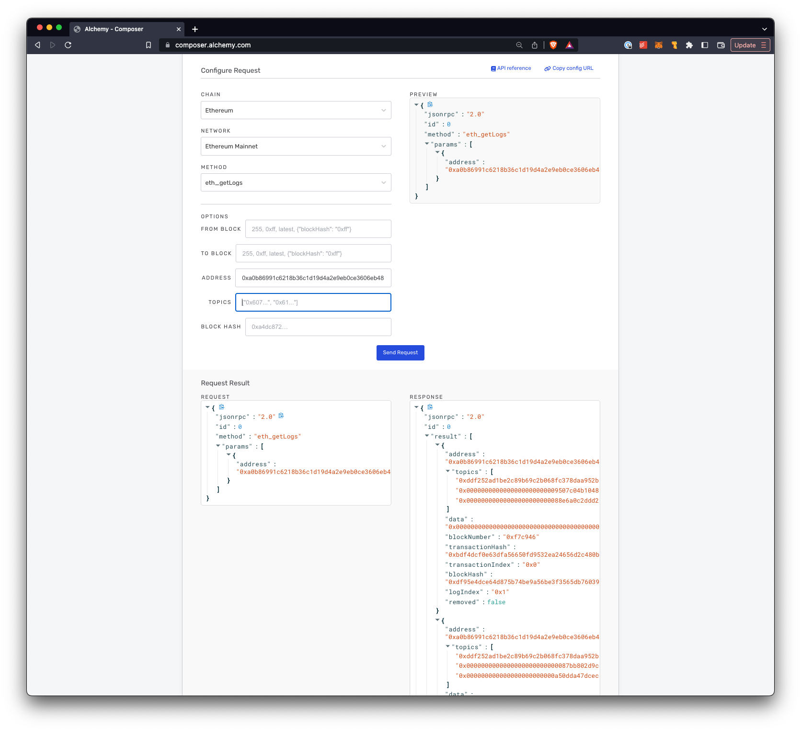

# Events

## Events

**Events** are the way Solidity and the EVM provide developers with logging functionality used to write information to a data structure on the blockchain that lives outside of smart contracts' storage variables.

Events are an abstraction on top of th EVM's low-level logging functionality, opcodes `LOG0` to `LOG4`. The specific opcode used will depend on the number of **topics** the event declares using the `indexed`` keyword. A topic is just a variable that we want to be included in the event and tells Solidity we want to be able to filter on the variable as well.

The low-level logs are stored in the transaction receipt of the transaction under the transaction receipts trie. **Logs are written by the smart contract when the contract emits events, but these logs cannot be read by the smart contract**. The inaccessability of the logs allows developers to store data on-chain that is more searchable and gas efficient than saving data to the smart contract's storage variables.

## Defining Events

Events are defined in smart contracts using the `event` keyword. Here is the [transfer event from the ERC20 smart contract](https://github.com/OpenZeppelin/openzeppelin-contracts/blob/v4.8.0/contracts/token/ERC20/IERC20.sol#L16). It is emitted whenever tokens are transferred from 1 account to another.

```solidity
interface IERC20 {
    event Transfer(address indexed from, address indexed to, uint256 value);
}
```

Here we can see the different components of an event:

- the event's name `Transfer`

- the event's topics `from` (sender's address), `to` (the receiver's address), `value` (the amount transferred)

- if a variable in the event is not marked as `indexed` it will be included when the event is emitted, but code listening on the event will not be ablel to filter on non-indexed varables (aka **topics**).

Whenever a `Transfer` event is emitted, the `from`, `to` and `value` data will be contained in the event.

## Emitting Events

Once an event has been defined we can emit the event from the smart contract. Continuing on from the ERC20 smart contract let's see where the [`Transfer` event is emitted](https://github.com/OpenZeppelin/openzeppelin-contracts/blob/v4.8.0/contracts/token/ERC20/ERC20.sol#L226-L248).

```solidity
function _transfer(
        address from,
        address to,
        uint256 amount
    ) internal virtual {
    // perform various checks, such as the `from` address has `amount` of tokens
    
    // do the transfer of tokens
    unchecked {
        _balances[from] = fromBalance - amount;
        _balances[to] += amount;
    }

    // the Transfer event is emitted here
    emit Transfer(from, to, amount);

    // perform various cleanup
}
```

## Listening to Events

If you remember the definition of an Event from above, smart contracts can write events, but not read events. So how do we listen/read to data that smart contracts cannot read?

We listen to and read events from code connected to a provider. From what we've learned so far in this course we could do this in JS code using an `ethers` provider to connect to a contract and listen to transfer events and do something with the event data.

```solidity
  const provider = new ethers.providers.Web3Provider(window.ethereum);
  const contract = new Contract(erc20TokenAddress, ERC20_ABI, provider);

  contract.on('Transfer', async (from, to, amount, data) => {
    console.log('Transfer event emitted. {from, to, amount, data}');
  });
```

Here we just simply print out the data of the event.

## Finding Events in the Logs of a Transaction Receipt

In the above section we used the higher-level `ethers` library to listen to `Transfer` events and do something with them when they are emitted.

Going back to our lessons on Ethereum Nodes and the low-level JSON-RPC endpoints, we could also use `eth_getLogs` to get at the same log data. The logs in the screenshot below were reading using [Alchemy's Composer tool](https://dashboard.alchemy.com/composer)



By using the lower level `eth_getLogs` call you can see that we would need to write the code to loop through all the logs looking for the addresses, and values that we might specifically be interested in. A much less convenient way to do than to use higher-level library like `ethers`.

## Suggested Reading

- Solidity docs on [Events and Indexed Topics](https://docs.soliditylang.org/en/v0.8.17/contracts.html#events)

- More details about the [LOG0](), [LOG1](), [LOG2]() and [LOG3]() opcodes.

## Questions

**Are events and logs part of the blockchain? What are your thoughts?**

- Events and logs are stored on the blockchain in transaction receipts

- But they are **not required for blockchain concensus**

- They **are** however verified by the blockchain since transaction receipt hashes are stored inside blocks

Can you think of any purpose of the LOG0 opcode?

- LOG0 can be very useful for logging/debugging while building your contracts.

## Conclusion

Events are a great way to emit information to the outside world of things happening with the blockchain. Emitted events can be found inside the Transaction Receipt of every transaction.