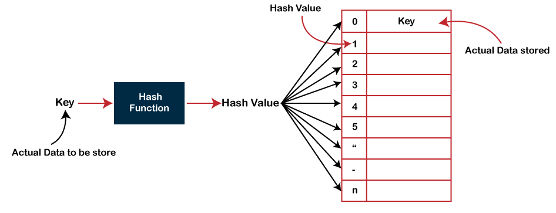
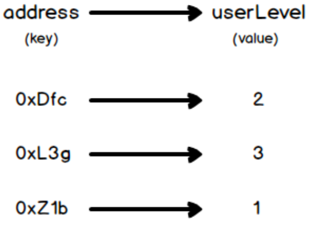

# Mappings

[Hardhat](https://hardhat.org/) arrived at a timely time because we were just learning about the many artifacts produced out of the Solidity compilation process, mainly two that we care about as devs: the ABI and the contract bytecode. Thanks to Hardhat, we are abstracted away from those artifacts to a level where it is much easier to work with them!

If you don't feel super comfortable with Hardhat yet (as we have many further activities that use it), don't worry BUT this is definitely one we would encourage you to go back and really refresh on. AU posted two different videos detailing every aspect of using Hardhat to compile and deploy smart contracts, you can check them out here:

1. [What is Hardhat?](https://university.alchemy.com/course/ethereum/md/639ac11a1422ec000466be36)

2. [Deploying & Interacting with Contracts](https://university.alchemy.com/course/ethereum/md/639a4cc4033c9b0004051a69)

## Mappings in Solidity

Have you ever heard of a [hash table](https://en.wikipedia.org/wiki/Hash_table)? If you've taken one or two computer science courses, chances are you have! If not, don't worry, you're in the right place. Let's jump in... 

A **hash table** is a data structure that implements an associative array (also referred to as a "dictionary"). In an associative array, data is stored as a _collection of key-value pairs_. The position of the data within the array is determined by applying a hashing algorithm to the key. This can be clearly seen in the diagram below:



As seen above, a key represents some data to be stored in the hash table data structure. That key is fed into a hash function which produces a hash value. That hash value dictates the index where the data, pertaining to the key, will be stored in the hash table.

Any time you "look up" (hence why hash tables are referred to as "dictionary" data structures!) a value by key, you will get whatever value is stored in the hash table back. [Hash functions](https://en.wikipedia.org/wiki/Hash_function) are deterministic, so you will always get the same value back as long as you provide the same key.

    - Oh, you thought this was purely a web3 bootcamp? Nope! We're diving into core computer science concepts because web3 uses so many of them! It's also good for you to know them for general software development, web3 or not. 

As in the diagram above, hash tables are a type of data structure that uses hash functions to store "keys" (ie. data) in a structured and deterministic way.

## Hash Table Data Structures Are Efficient

Hash tables enable very efficient searching, in fact, they enable the "holy grail" **O(1)** search time. Hash tables do not require a brute force search or a for loop to lookup a value thanks to the deterministic nature of hash functions! You can just say, gimme whatever value is held at this key and the hash table data structure will comply. 


A cartoonist hit the nail on the head with the above drawing! Hash tables enable the same O(1) search efficiency as these backpacks hung on labelled hooks!

## Mappings

In Solidity, hash tables are called **mappings**. They function pretty much the exact same as hash tables. 

**Mappings** act as hash tables which consist of key types and corresponding value type pairs.

They are defined like any other variable type in Solidity:

```solidity
mapping(_KeyType => _ValueType) public mappingName;
```

## Useful for `address` Association

Solidity mappings are particularly useful for `address` association.

Thanks to mappings, you can associate an Ethereum address to a specific value. Here's a few examples we could use `address` association for:

_Keeping track of how many sodas a user has purchased from a vending machine smart contract:_

```solidity
mapping(address => uint) public sodasPurchased;
```

The above code snippet simply says:

`Oy, Solidity! Create a hash table that "maps" an address type to a uint type. This will help me create an organized table view of how many sodas a specific Ethereum address purchases, and I will update this table any time any address calls the purchaseSoda() function. Oy, and make it public because I want anyone in the world to be able to query this mapping!`

    - Oof, this is such a fantastic data structure that enables us to do so much cool stuff! Let's keep going...

## Accessing Value Types From A Mapping 

Let's take a look at Solidity snippets that use the `mapping` data structure...

You can create a specific function `numSodasPerUser` and pass in the key to extract the value associated with it (using the same `sodasPurchased` mapping declared in the example above):

```solidity
function numSodasPerUser(address _userAddress) public returns (uint) {
    return sodasPurchased[_userAddress];
}
```

The above function `numSodasPerUser` takes one argument of `address` type. Anyone can call this function because it is `public`. Simple enough, you feed it any Ethereum address and it will "look up" that address in the `sodasPurchased` mapping, returning the value held in the mapping for that key.

If your EOA has purchased `5` sodas (by calling the `purchaseSoda()` five times!), that record should be held in the sodasPurchased function. Wondering what that function looks like? Or how updating the mapping works? Wonder no further:

```solidity
function purchaseSoda() public {
    // we can't dispense a soda if there are none left!
    require(numSodas > 0, "Sodas must be in stock!");
    // update the mapping to reflect this msg.sender has purchased another soda
    sodasPurchased[msg.sender] += 1;
    // update the numSodas state variable to reflect there is one less soda in the vending machine smart contract
    numSodas--;
}
```

## Mappings in Production: [ERC-20 Tokens](https://docs.openzeppelin.com/contracts/3.x/erc20)

The above examples seem a little silly no? Why would we want to keep track of how many sodas a user has purchased from a vending machine smart contract?! Don't worry, that example is just for learning purposes... let's look at an application of `mapping` that is core to the Ethereum ecosystem: [ERC-20 tokens](https://solidity-by-example.org/app/erc20/)!

That's right! ERC-20 tokens that we've all probably used or know of (ie. $USDC, $DAI, $UNI, $AAVE, etc) use a `mapping` to support core functionality. Can you already guess what use-case `mappings` help ERC-20 contracts with?

ERC-20 tokens use a `balanceOf` **mapping** to keep track of user balances in an ERC-20 smart contract.

    - Just like our simple vending machine smart contract example used a `sodasPurchased` mapping!

Take a look at the [$DAI smart contract on Ethereum mainnet](https://etherscan.io/token/0x6b175474e89094c44da98b954eedeac495271d0f#code).

`Line 90` of the $DAI smart contract declares a `balanceOf` mapping:

```solidity
mapping (address => uint) public balanceOf;
```

Here's a short video showing a quick query of the mainnet $DAI smart contract's `balanceOf` mapping:


## Other Use Cases For Mappings?

Yep, tons! Really anything that requires a 1-to-1 tracking based on key-value pairings is up for grabs. Here's a few more written in Solidity:

```solidity
mapping(address => uint) public balanceOf; // ERC-20s
mapping(address => bool) public hasVoted; // DAOs
mapping(uint => bool) public isMember; // DAOs
mapping(string => uint) public userZipCode; // general info tracking
```


Maybe you are writing a smart contract that will power some sort of on-chain video game? You'd have to keep track of what level a user is to unlock further features inside the game, like this quick high-level diagram:



In Solidity, you can just implement a `mapping` to keep track of `userLevel`:

```solidity
mapping(address => uint) public userLevel;
```

## Nested Mappings

In cases where _multiple_ relationships must be kept track of (shoutout to all you SQL geeks!), Solidity lets you do so via a **nested mapping**, which are declared exactly the same as regular `mapping` but nested:

```solidity
mapping(address => mapping(uint => bool)) public votesPerProposal;
```

The above nested mapping is a perfect use case, for one, for DAOs. DAOs must typically keep track of many proposals and whether addresses vote for or against that specific proposal.

The nested mapping helps us keep track of all that record in one single place!

Notice it maps an `address` (the DAO voter) type to a `mapping` that itself maps a `uint` (the proposal id #) to a `bool` (whether the DAO voter supports that specific proposal).

    - Think of a relational database table! A user can link to one table which links to more tables…

Can you think of other use cases for nested mappings?

## Suggested Reading

- [Mappings explained in under 2 minutes](https://medium.com/upstate-interactive/mappings-in-solidity-explained-in-under-two-minutes-ecba88aff96e)

- [Solidity docs - mapping](https://docs.soliditylang.org/en/v0.8.4/internals/layout_in_storage.html)

- [OpenZeppelin ERC-20 Standard](https://docs.openzeppelin.com/contracts/3.x/erc20)

- [Solidity by Example - Mappings](https://solidity-by-example.org/mapping/)

- [Arrays vs Mappings](https://ethereum.stackexchange.com/questions/2592/store-data-in-mapping-vs-array)

- [Approve-Transfer From Flow Explained - this is specific to ERC-20 tokens!](https://ethereum.stackexchange.com/questions/46457/send-tokens-using-approve-and-transferfrom-vs-only-transfer)

## Conclusion

Mappings are super useful data structures in Solidity. Developers are able to keep track of records in an organized and efficient manner. `address` association is particularly powerful, since developers can now code in specific record-keeping around any Ethereum address.