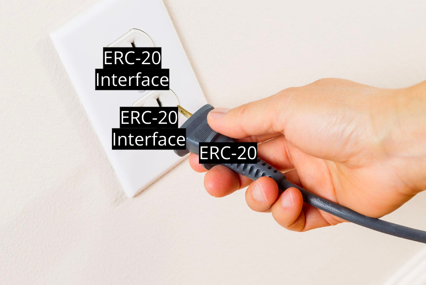

# ERC-20 Tokens

## ERC-20 Tokens Overview

An **ERC-20 token** is a representation of some sort of asset on the Ethereum network. These could be anything:

- shares in a company
- reward system points
- voting rights
- cryptocurrency
- lottery tickets
- on-chain Chuck E Cheese tokens
- anything you can think of!

This is what has made Ethereum a popular choice for many different use cases across industries - anyone can tokenize any asset.

## Importance of the ERC-20 Token Standard

A key point to understand here is that ERC-20 is a **technical standard**!



Can you imagine the chaos it would be if every time someone wanted to create a new token, they would create a new variation, containing different variables and methods, every time? This would be the equivalent of creating a different electrical plug 🔌 every time you created a new consumer appliance (ie. microwaves, toasters, etc).

The main use of the ERC-20 standard is to increase compatibility of the ecosystem. Exchanges like Uniswap are then able to build incredibly powerful applications because they create infrastructure that supports the ERC-20 interface; this then triggers developers who use the ERC-20 standard to develop, instant compatibility with Uniswap and many other dApps! 🤝 Integration otherwise would be a nightmare.

## ERC-20 Token Smart Contract

At the base level, an ERC-20 token smart contract simply uses a **`mapping`** to keep track of **fungible tokens**: any one token is exactly equal to any other token; no tokens have special rights or behavior associated with them.

- This makes ERC-20 tokens useful for things like a medium of exchange currency, voting rights, staking, and more...

In the last section, we also defined a simple `Token` contract:

```solidity
contract Token {
    mapping(address => uint) public balances;
}
```

That's easy enough and as we covered in [5.1 - Mappings](https://university.alchemy.com/course/ethereum/md/introduction-to-mappings), the $DAI smart contract (which follows the ERC-20 standard!) is basically powered by a mapping that looks exactly the same.

## ERC-20 Token Interface

As we covered above, [ERC-20](https://eips.ethereum.org/EIPS/eip-20) defines a common **interface** so that any application can use them in a standard way.

This simplifies and eases developers’ tasks, because they can proceed with their work, knowing that each and every new project won’t need to be redone every time a new token is released, as long as the token follows the rules.

- This means you can build an app with full knowledge of the ERC-20 token standard and it immediately becomes compatible with any users and builders that are also using ERC-20!

The interface consists of a number of functions that must be present in every implementation of the standard, as well as some optional.

An ERC-20-compliant token contract must provide at least the following:

- **name**, **symbol**, and **decimals** are all _optional_ fields

- **totalSupply** defines the current circulating supply of the tokens

- **balanceOf** will return the balance for a particular user

- **transfer** which is the bread and butter, transfer from one account to another

- **approve**, **transferFrom** and **allowance** are methods for other contracts moving your funds

In solidity, the ERC-20 interface looks like this:

```solidity
pragma solidity 0.8.4;

interface IERC20 {

    function totalSupply() external view returns (uint256);
    function balanceOf(address account) external view returns (uint256);
    function allowance(address owner, address spender) external view returns (uint256);

    function transfer(address recipient, uint256 amount) external returns (bool);
    function approve(address spender, uint256 amount) external returns (bool);
    function transferFrom(address sender, address recipient, uint256 amount) external returns (bool);


    event Transfer(address indexed from, address indexed to, uint256 value);
    event Approval(address indexed owner, address indexed spender, uint256 value);
}
```

In Solidity, you can **inherit** an interface into your own smart contract. Inheriting an interface means you **must** define all the methods declare on the interface. This means you can create an ERC-20 compatible smart contract **in a flash** by simply inheriting the interface via the `is` keyword.  Here is an example of a sample contract inheriting the interface displayed above:

```solidity
contract MyContract is IERC20 {
    // BOOM, your contract is ERC-20 compatible!
}
```

## ERC-20 Data Structures

There are two important data structures used by the ERC-20 token standard that we should review:

1. **`balances`**: `mapping` of token balances, by owner. Each transfer is a deduction from one balance and an addition to another balance.

2. **`allowances`**: `mapping` of allowances/delegate spending. This is a _nested_ mapping in which the primary key is the address of the token owner which maps to a spender address and amount delegated to spend.

- The `allowances` mapping will be further covered in a later section!

## ERC-20 `transfer`

In ERC-20 compatible smart contracts, there are two ways to change balances:

1. **`transfer`**: A call to the `transfer` method is straightforward call to the contract’s transfer function, takes just one simple transaction.

2. **`approve-transferFrom`**: This way of transferring tokens is covered further in the next section!

## Suggested Reading

- [OpenZeppelin ERC-20 Standard](https://docs.openzeppelin.com/contracts/3.x/erc20)

- [Top Tokens on Etherscan](https://etherscan.io/tokens)

- [Understand the ERC-20 Token Smart Contract](https://ethereum.org/en/developers/tutorials/understand-the-erc-20-token-smart-contract/)

- Leg up on next section: [difference between sending tokens using transfer and approve-transferFrom](https://ethereum.stackexchange.com/questions/46457/send-tokens-using-approve-and-transferfrom-vs-only-transfer)

- [Mastering Ethereum - Chapter 10: Tokens](https://github.com/ethereumbook/ethereumbook/blob/develop/10tokens.asciidoc)


