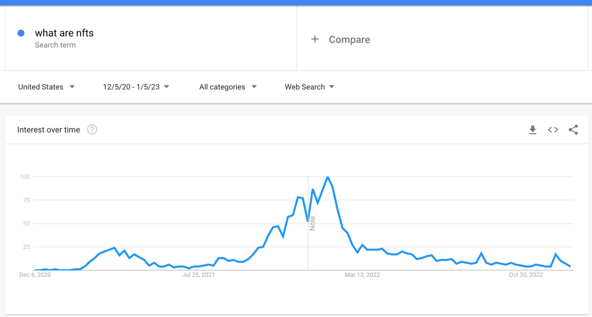

# What are NFTs?

This was just the question everyone was asking in early 2022! The term NFT really caught mainstream attention in a big way, just take a look at [google search terms](https://trends.google.com/trends/explore?date=2020-12-05%202023-01-05&geo=US&q=what%20are%20nfts)!

## Non-Fungible Tokens

The acronym NFT stands for Non-Fungible Token. All this means it is a token that has unique characteristics. Today most people associate NFTs with digital art ownership. People are generally aware of some of the more well known NFT collections like Crypto Punks or Bored Apes:

However, an NFT is useful to represent any type of ownership on the blockchain when it comes to items that have unique characteristics. These could be items that unlock digital experiences like app privileges, tickets to digital shows, or video game items. They could also represent real-world object ownership, although that can be difficult in practice. With so many use cases, NFTs are still very much in the early stages. It's exciting to see that, in this early stage, people have already come to associate digital ownership with blockchains! That is, after-all, what gives NFTs their unique value proposition. They represent digital ownership of some unique good on the blockchain.

## NFTs in Practice

There are many different token standards for NFTs. The two most common are ERC721 and ERC1155 (curious about the difference? Check out [this blog article](https://www.alchemy.com/blog/comparing-erc-721-to-erc-1155)). Unlike ERC20s, NFTs will often store some of their data off-chain. This surprises many people the first time they hear it, but it should make sense given what we know about blockchains from this course! It's quite expensive to store one `uint256` in Ethereum, can you imagine if you were trying to store a 5mb image? The data that is stored off-chain is often referred to as metadata and there is an [emerging standard](https://docs.opensea.io/docs/metadata-standards) for how metadata should be structured.

- Before we dive into metadata storage, it is important to note that any data that is not on-chain cannot be enforced on-chain. Let's consider an example: if you have a video game sword NFT which had an attack power of `20` and you decided to store that attribute off-chain, you would not be able to use this attribute in a smart contract. This could be problematic if you were trying to build a decentralized battle system!

## Metadata Storage

Once you learn that metadata is stored off-chain, the big question becomes: where off-chain does it get stored? If it was hosted on someone's personal server, that would be pretty worrisome, especially if that NFT was worth something significant to you! If that person decides to stop serving your image requests tomorrow, your NFT may never render again.

Fortunately, most NFT collections use Decentralized File Networks like [IPFS](https://ipfs.tech/) and [Arweave](https://www.arweave.org/). In the following guide we're going to be using IPFS, so let's talk about it. IPFS uses something called "content addressing" to store data on a peer-to-peer network. All this means is that the data is stored as a hash of the contents. When you ask IPFS for an image, you provide IPFS with a hash and it goes and finds someone on the network who is serving that hash. If the file contents retrieved don't match the hash you requested, it is discarded out by the protocol.

- An excellent resource for learning more about IPFS is [ProtoSchool](https://proto.school/). Specifically, take a look at this section on [content addressing](https://proto.school/content-addressing).

When you look up a resource on IPFS you provide the hash in your query, so you are essentially telling IPFS **what** you're looking for. This is as opposed to looking up a resource on the internet. On the internet, you provide a URL, which tells the browser **where** to go to find your resource. This doesn't necessarily mean that your image will always be available, but there is a significant benefit here. Let's break this down to example, consider the following two different scenarios for your NFT metadata:

1. Your NFT metadata is stored on https://www.example.com/my-nft-metadata

**OR**

2. Your NFT metadata is a hash `bafybeigdyrzt5sfp7udm7hu76uh7y26nf3efuylqabf3oclgtqy55fbzdi` which you can look up on IPFS.

In the first scenario, example.com might store your NFT metadata today (it doesn't), but the administrator of the website could choose to take it down at anytime. If your NFT metadata is not upgradeable, you are out of luck unless the administrator chooses to host it again.

In the second scenario, anyone who is serving your image on the peer-to-peer IPFS network will be able to fulfill your request to render your image. If everyone else on the network stops serving your image, you can do so yourself and your IPFS reference will still resolve.

To summarize, IPFS doesn't guarantee you permanence but it does give you a nice property. You can, however, pay someone to continue to host your file on IPFS. There are many third parties that provide this service ([pinata](https://www.pinata.cloud/) for example) or you could pay a miner on the [Filecoin blockchain](https://filecoin.io/) to host your data.

## Wrap Up

NFTs are an exciting topic! They entered mainstream consciousness in a surprising way over the last few years and, yet, they are still very much in their infancy. They can represent so many different types of digital goods, not just images! There are several different NFT smart contract standards which have different tradeoffs. NFTs can choose to store metadata off-chain, which removes on-chain enforcement of the attribute and distributed file storage systems have their own set of tradeoffs.
